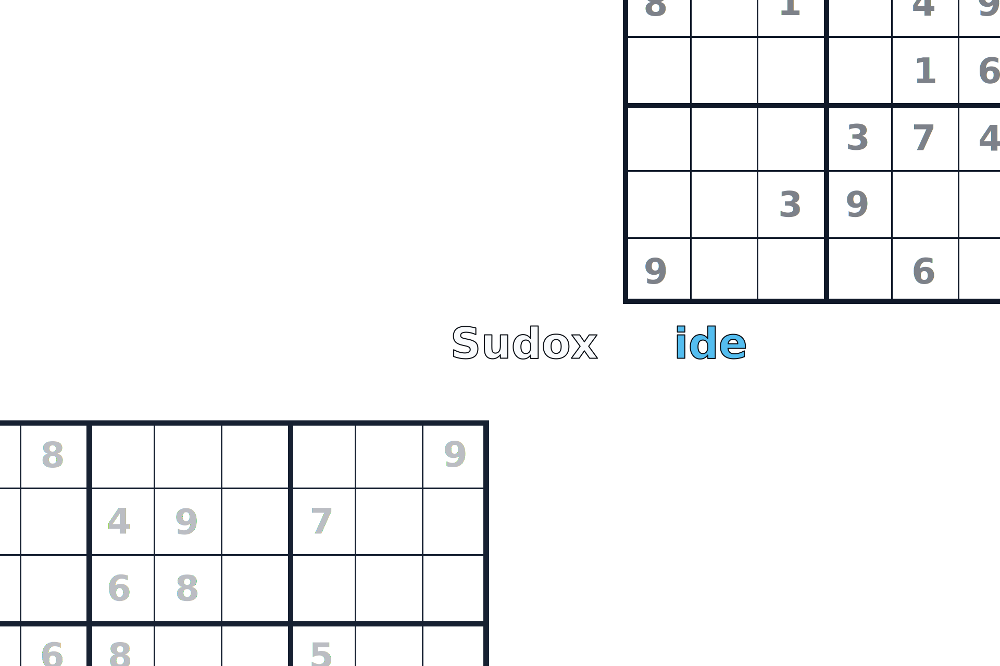

# Sudoxide

[](https://github.com/Nervonment/sudoxide/releases/latest)


Sudoxide 是一个桌面端的数独软件，使用 [Tauri](https://tauri.app) 和 [Next.js](https://nextjs.org) 制作。

## 特点

- 生成**6种**不同难度的数独。无论是想休闲消遣还是挑战自我，都能找到合适的题目。
- 操作方式友好，鼠标悬浮在格子上时，输入数字即可填充，无需不断点击。
- 支持手动或自动**标记候选数**。支持**撤回**、**重做**。
- **提示**功能。内置常用的数独技巧提示，可以为普通及以下难度的题目提供解题参考（困难难度以上暂未实现完全提示）。（完整的数独技巧列表请参考 [HoDoKu 的文档](https://hodoku.sourceforge.net/en/techniques.php) 或 [Sudopedia](https://www.sudopedia.org/wiki/Solving_Technique)，此软件暂只实现了其中部分技巧。）

## 安装

请前往[发布页面](https://github.com/Nervonment/sudoxide/releases/latest)下载相应平台的安装包进行安装。

## 构建

首先确保你安装了 [Node.js](https://nodejs.org/) 和 [Rust](https://www.rust-lang.org/zh-CN/)。

克隆本仓库，将 [src-tauri/tauri.conf.json](src-tauri/tauri.conf.json) 中的 `tauri.updater.active` 改为 `false`。然后运行：
```
npm install
npm run tauri build 
```

## 链接

[Nervonment/sudoku](https://github.com/Nervonment/sudoku)：数独生成、分析和求解支持。